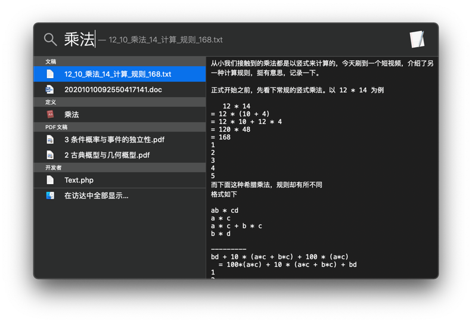

# memokeeper
memo keeper  toolkits

watch video --> [demonstration mp4](/demo.mp4)

INPUT:
- shortcuts for snippets
- manual recording

OUTPUT:
- inverted index
- structured text

Nothing done here, but for `TODO` list.
